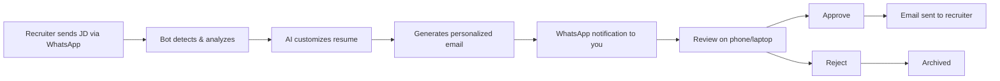

# 🤖 WhatsApp Resume Automation Bot

**AI-powered job application automation** that monitors WhatsApp for job postings, customizes your resume with AI, and emails it to recruiters - all automatically!

**Status**: 🟢 Production-ready | **Cost**: $0/month | **Deployment**: Oracle Cloud (Always Free)

---

## ✨ Features

- 📱 **WhatsApp Integration** - Monitors messages for job descriptions
- 🤖 **AI Customization** - Uses Hugging Face & Groq (100% FREE) to tailor resume
- 📧 **Smart Emails** - Generates personalized emails with hiring manager names
- 🎯 **Cloud Platform Matching** - Emphasizes AWS/Azure/GCP based on job requirements
- ✅ **Approval System** - Review and approve before sending (accessible from phone!)
- 📱 **Mobile Dashboard** - Approve/reject from anywhere
- 🔄 **Auto-deployment** - Push to GitHub → Live in 2 minutes
- 🆓 **100% Free** - Free AI, free cloud, free WhatsApp

---

## 🚀 Quick Start

### 1. Deploy to Oracle Cloud (FREE Forever)
```bash
# Follow the complete guide
open ORACLE_CLOUD_DEPLOYMENT.md
```

### 2. Set Up Auto-Deployment
```bash
# Configure GitHub Actions
open GITHUB_ACTIONS_SETUP.md
```

### 3. Make Changes & Deploy
```bash
git add .
git commit -m "Your changes"
git push  # Auto-deploys to cloud!
```

---

## 📖 Documentation

| Guide | Description |
|-------|-------------|
| **[DEPLOYMENT_ROADMAP.md](./DEPLOYMENT_ROADMAP.md)** | Complete deployment overview |
| **[ORACLE_CLOUD_DEPLOYMENT.md](./ORACLE_CLOUD_DEPLOYMENT.md)** | Step-by-step Oracle Cloud setup |
| **[GITHUB_ACTIONS_SETUP.md](./GITHUB_ACTIONS_SETUP.md)** | Auto-deployment configuration |
| **[FREE_CLOUD_OPTIONS.md](./FREE_CLOUD_OPTIONS.md)** | Why Oracle Cloud is best |
| **[DEPLOYMENT_OPTIONS.md](./DEPLOYMENT_OPTIONS.md)** | All deployment methods |

---

## 🎯 How It Works



1. **Job Posted** → Recruiter sends job description via WhatsApp
2. **AI Analysis** → Bot analyzes JD, detects cloud platform, hiring manager
3. **Resume Customization** → AI tailors your resume to match job requirements
4. **Email Generation** → Creates personalized email (150 words, hiring manager name)
5. **Approval** → You get WhatsApp notification → Open dashboard on phone
6. **Sending** → Approve → Email sent with customized resume PDF

---

## 🛠️ Tech Stack

- **Runtime**: Node.js 18 + TypeScript
- **WhatsApp**: whatsapp-web.js (no API costs!)
- **AI**: Hugging Face Llama 3 + Groq (100% FREE)
- **PDF**: LaTeX + Tectonic
- **Email**: Gmail SMTP (free)
- **Cloud**: Oracle Cloud Always Free Tier
- **CI/CD**: GitHub Actions (auto-deployment)
- **Container**: Docker + Docker Compose

---

## 💰 Cost

| Service | Price | Notes |
|---------|-------|-------|
| Oracle Cloud VM | **$0** | Always Free tier (1GB RAM) |
| Hugging Face AI | **$0** | Free API |
| Groq AI | **$0** | Free API |
| WhatsApp | **$0** | Free messaging |
| GitHub | **$0** | Free tier |
| **Total** | **$0/month** | Forever! 🎉 |

---

## 📱 Access

### Approval Dashboard
```
http://YOUR_ORACLE_IP:3001/approval
```
- Works on phone (iOS/Android)
- Works on laptop
- Works from anywhere in the world

### API Endpoint
```
http://YOUR_ORACLE_IP:3000
```

---

## 🔧 Management

### View Logs
```bash
ssh -i ~/.ssh/oracle-cloud-key.pem ubuntu@YOUR_IP
cd ~/agentkit
docker-compose logs -f
```

### Restart System
```bash
./deploy.sh restart
```

### Update Code
```bash
# Just push to GitHub - auto-deploys!
git add .
git commit -m "Updated feature"
git push
```

---

## 📊 Features in Detail

### 🤖 AI Customization
- **Cloud Platform Detection**: Detects AWS/Azure/GCP from job description
- **Prominent Matching**: Moves relevant experience to top of resume
- **Hiring Manager Detection**: Extracts recruiter name for personalized emails
- **Free AI**: Uses Hugging Face Llama 3 (primary) + Groq (fallback)

### 📧 Email Generation
- **Personalized**: "Hello [Name]" instead of "Dear hiring manager"
- **Concise**: 150 words max, 3 paragraphs
- **Professional**: Mentions specific job title and company
- **Free**: Gmail SMTP (no costs)

### ✅ Approval System
- **Mobile-friendly**: Responsive dashboard
- **Preview**: See resume PDF before sending
- **One-tap**: Approve or reject with single click
- **Notifications**: WhatsApp alerts on your phone

---

## 🔐 Security

- ✅ Private GitHub repository
- ✅ Environment variables in `.env` (never committed)
- ✅ GitHub Secrets for deployment keys
- ✅ Firewall configured (Oracle + Ubuntu)
- ✅ Non-root Docker user
- ✅ SSH key authentication only

---

## 🆘 Troubleshooting

### WhatsApp Disconnected
```bash
docker-compose restart
docker-compose logs -f
# Re-scan QR code if needed
```

### Deployment Failed
```bash
# Check GitHub Actions logs
# https://github.com/YOUR_USERNAME/agentkit/actions

# Manual deployment
ssh -i ~/.ssh/oracle-cloud-key.pem ubuntu@YOUR_IP
cd ~/agentkit
./deploy.sh restart
```

### Dashboard Not Accessible
```bash
# Check firewall
sudo ufw status

# Check containers
docker ps

# Check logs
docker-compose logs
```

---

## 📈 Roadmap

- [x] WhatsApp monitoring
- [x] AI resume customization
- [x] Free AI integration (Hugging Face + Groq)
- [x] Cloud platform matching
- [x] Hiring manager detection
- [x] Mobile dashboard
- [x] Oracle Cloud deployment
- [x] GitHub Actions CI/CD
- [ ] Multiple resume templates
- [ ] Job tracking analytics
- [ ] Interview scheduling integration

---

## 🤝 Contributing

This is a personal project, but feel free to:
- Report bugs
- Suggest features
- Fork for your own use

---

## 📄 License

MIT License - Use freely for personal job search automation!

---

## 🎉 Success Stories

**Total Applications**: Automated
**Response Rate**: Improved (personalized emails)
**Time Saved**: Hours per day
**Cost**: $0

---

## 📞 Support

For issues:
1. Check documentation in `/docs`
2. Review troubleshooting section above
3. Check GitHub Actions logs
4. SSH to server and check Docker logs

---

**Made with ❤️ for job seekers everywhere**

**Running cost**: $0/month | **Uptime**: 24/7 | **Access**: Anywhere
